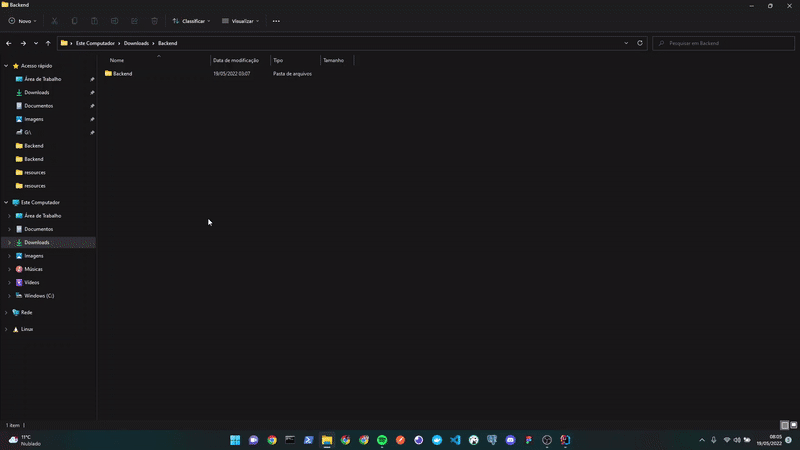
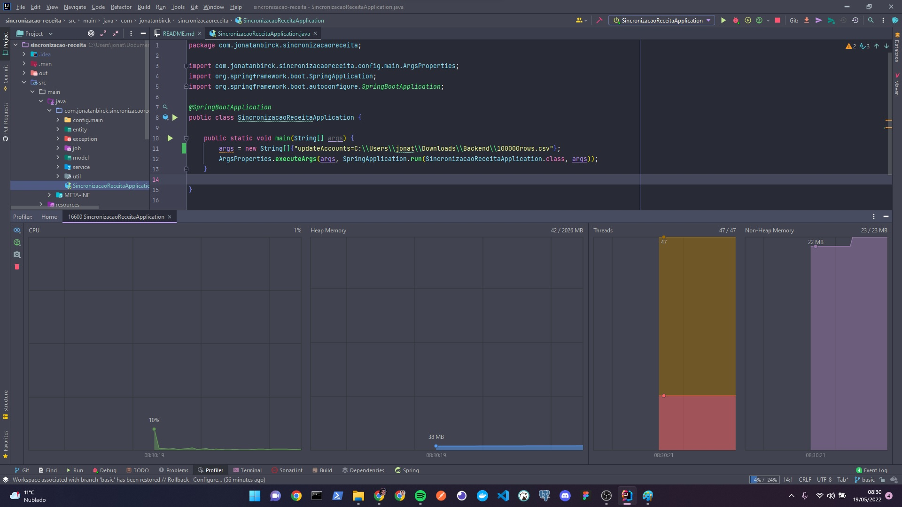

## 📙 Sumário
- [Projeto](#projeto)
- [Tecnologias](#tecnologias)
- [Como executar](#configuração)
    - [Ambiente](#ambiente)
    - [Dicas](#dicas)
- [Ilustrações](#ilustrações)
- [Fluxo de desenvolvimento](#FLuxo de desenvolvimento)

## 💻 Projeto
Um projeto de demonstração visando construir um cenário de criação de contas via Receita Federal. Realizando processamento de arquivos CSV utilizando Spring Boot.

## 🚀 Tecnologias
✔️Java 17
✔️Spring Boot 2.6.7
✔️IntelliJ IDEA

## ⚙ Configuração

### Ambiente
Não é necessária nenhuma configuração adicional.
Pode ser executado standalone, acessando a pasta "out\artifacts" e executando: java -jar sincronizacao-receita.jar <args>

Existem dois tipos de argumentos mapeados:
- Envia e atualiza contas no serviço da Receita Federal (fake): updateAccounts=${caminhoArquivo}
- Exemplo: java -jar sincronizacao-receita.jar updateAccounts=C:\Users\jonat\Downloads\Backend\200rows.csv

- Criar um arquivo .csv com dados fakes apenas para teste utilizando: java -jar sincronizacao-receita.jar createFakeCsv=${quatidadeLinhas},${caminhoArquivo}
- Exemplo: java -jar sincronizacao-receita.jar createFakeCsv=200,C:\Users\jonat\Downloads\Backend\200rows.csv

## 📷 Ilustrações

## 👷 FLuxo de desenvolvimento

### Cenário de Negócio
Todo dia útil um colaborador da empresa recebe e organiza as informações de contas para enviar ao Banco Central.
Todas agencias enviam arquivos Excel à Retaguarda. Hoje a empresa já possui mais de 2 milhões de contas ativas.
Esse usuário da retaguarda exporta manualmente os dados em um arquivo CSV para ser enviada para a Receita Federal.

### Funcionalidades
- Criar uma aplicação SprintBoot standalone. Exemplo: java -jar SincronizacaoReceita <input-file>
- Processar um arquivo CSV de entrada.
- Enviar a atualização para a Receita através do serviço (Simulado pela classe ReceitaService).
- Retornar um arquivo com o resultado do envio da atualização da Receita. Mesmo formato adicionando o resultado em uma
   nova coluna.

### Desenvolvimento
- Primeiramente foi realizada uma (POC - Prova de conceito), buscando  encontrar bibliotecas que ajudassem no desenvolvimento.
(OpenCsv, Spring batch entre outros) Spring batch se demonstrou o mais maduro e apropriado para o cenário de negócio, 
contudo ele foca muito em processamento de dados utilizando como fonte ou destino o banco de dados. Sendo assim e também por questões de tempo. 
Acabei optando por não utilizar nenhuma dependência.
- Ao criar o repositório, surgiu a ideia de separar o desafio em tarefas, simulando o comportamento de uma sprint, 
entretanto devido a falta de tempo, acabei por realizar diretamente todo o desafio.
- Alguns detalhes bem importantes, foquei em implementar processos em paralelo, assim pode ser processado muitos dados em menos tempo e
consumo de memória (evitando o carregamento do arquivo diretamente para a memória).

### Melhorias
- Implementar mais validações ao ler o arquivo, talvez utilizar (javax.validation) que fornece algumas anotações para campos a fim de facilitar o desenvolvimento.
- Implementar uma APIRest com alguns endpoint, tornando o processo de atualização de contas mais simples e visual ao usuário.
- Implementar Sprint Batch.